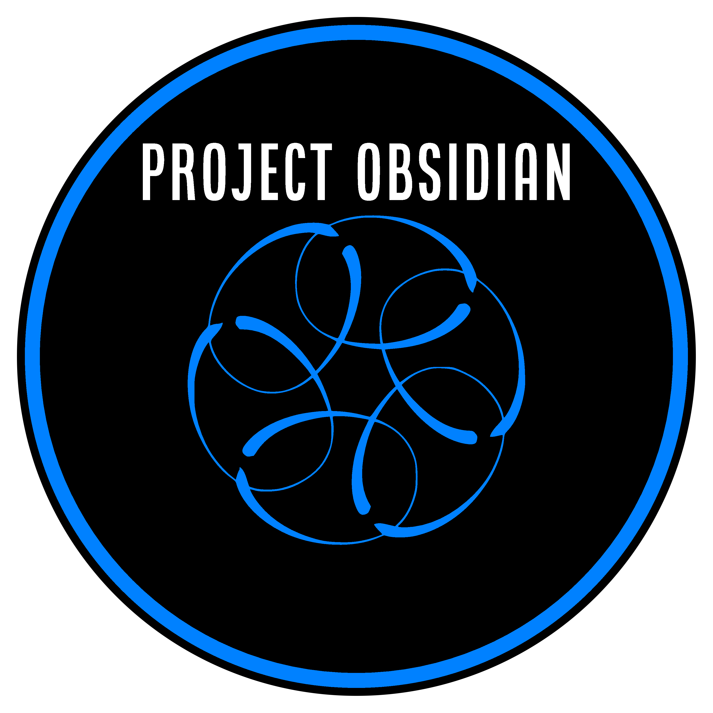

[BlueTeamVillage](https://blueteamvillage.org/) | [DEFCON 31](https://defcon.org/html/defcon-31/dc-31-index.html) | [Project Obsidian CTF](https://blueteamvillage.org/events/def-con-31/btv-ctf/)

# Blue Team Village - Project Obsidian @ DEFCON 31
Welcome to the Blue Team Village - Project Obsidian @ DEFCON 31!

## Table Of Contents
- [About](#about)
- [Village Content](#village-content)
  - [Talks](#talks)
- [CTF](#ctf)
    - [SIEM Access](#siem-access)
    - [Offline Access](#offline-access)

## About
The Blue Team Village is a community of Blue Teamers, Defense, and InfoSec professionals. We are a community of defenders, and our mission is to empower and enable defenders to learn and grow within the cyber defense field. We do this by providing a community driven approach to education, collaboration, and knowledge sharing.

## Village Content
The Blue Team Village will be hosting a variety of talks, workshops, and other events during DEFCON 31. Please visit the link below to view the full schedule of events: https://info.defcon.org/tag/?id=40282

### Talks
Talks are broken into two sections this year. The 101 track is for those new to the field, and the Kill Chain track covers the attack simulation we conducted during Project Obsidian. The talks are split into stations for each major area of cyber defense.

- [Forensics](Forensics/README.md)
- [Incident Response](IR/README.md)
- [Cyber Threat Hunting](CTH/README.md)
- [Insider Threat](Insider/README.md)
- [Detection Engineering](DE/README.md)
- [OT/ICS](OT/README.md)
- [Security Engineering](SecEng/README.md)

## CTF

### CTF Overview
https://blueteamvillage.org/events/def-con-31/btv-ctf/

### CTF Access
Please visit the link below to start the CTF:

https://ctf.blueteamvillage.org/

The CTF will run from Friday Aug 11 @ 10:00am PST through Sunday Aug 13 @ 12:00am PST 

CTF teams can have a maximum of 4 players.

### SIEM Access
The SIEMS provided are for use during DEFCON to work along side workshops, talks, and other events.

These Credentials, and the content of these systems, are for workshop and educational purposes only. By using these credentials you agree to not grief, deface, or disable these SIEM platforms.

Username: `analyst` Password: `SilencePrintWestThus8`

* [Splunk](https://splunk.blueteamvillage.com)
* [Graylog](https://graylog.blueteamvillage.com)
* [Arkime](https://arkime.blueteamvillage.com)
* [Velociraptor](https://velociraptor.blueteamvillage.com)
* [SecurityOnion](https://securityonion.blueteamvillage.com)
    * SecurityOnion username NEEDS to be a an e-mail, so use `analyst@blueteamvillage.com`

### Offline Access
For those interested in exploring data from Blue Team Village talks and workshops further, all logs collected during the execution of Project Obsidian are available for public download at https://media.blueteamvillage.org/DC31/Obsidian/

Protected .zip files can be unlocked with the passphrase <tbd>

Some of the files on this server contains files which might be harmful for your computer. These files are meant to be used as part of Blue Team Village activities. Blue Team Village doesn't take any responsiblity for harm caused by the files which are hosted on this site.

