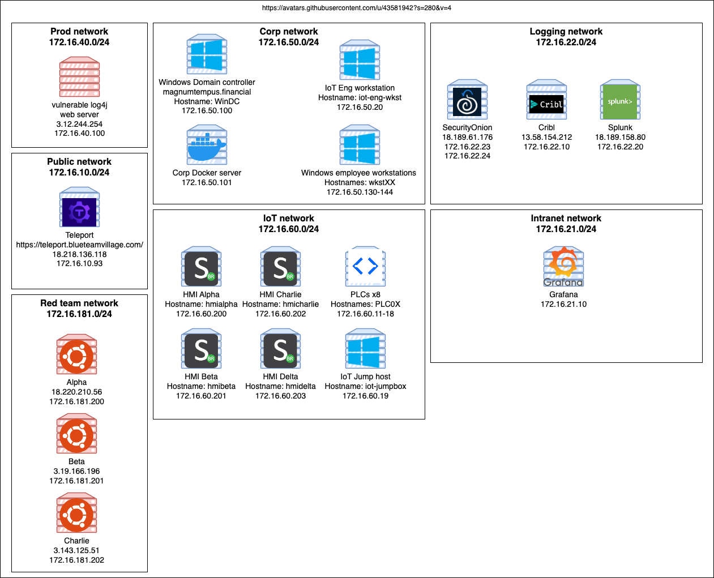

# DC31-obsidian-sec-eng

## Github repo with infra-as-code
[DC31-obsidian-sec-eng](https://github.com/blueteamvillage/DC31-obsidian-sec-eng)

## Network diagram

## Supported versions
* `Terraform v1.3.71`
* `Ansible v2.14.1`
* `pre_commit v2.21.0`
